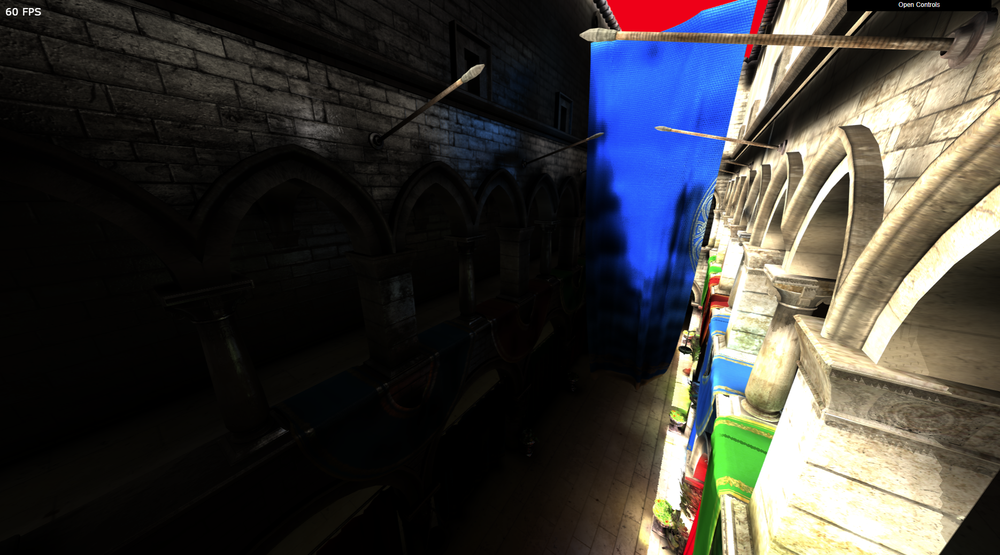

# gi-voxels

Playground engine using webgl2 focusing on modern rendering and global illumination techniques.

  

## Demo 
Available [here](http://novalain.github.io/gi-voxels) 

## Features
* Global Illumination using Voxel Cone Tracing  
(Cyril Crassin, Fabrice Neyret, Miguel Saintz, Simon Green and Elmar Eisemann) https://research.nvidia.com/sites/default/files/publications/GIVoxels-pg2011-authors.pdf
  * Indirect diffuse lightning
  * Specular lightning
  * Ambient Occlusion
* Volume renderer for voxel debugging
* Directional lights
* Point lights
* Obj & Mtl support
* Shadow mapping
* Standard primitives (cube, sphere, quad)
* Texure mapping (diffuse, specular, normal)

## Dependencies 
* webgl-obj-loader https://github.com/frenchtoast747/webgl-obj-loader
* gl-matrix http://glmatrix.net

## Installation
* `npm install`
* `npm run dev` for dev
* `npm run build` for dist
